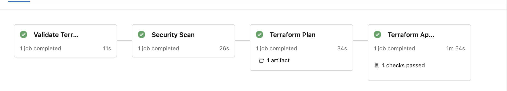
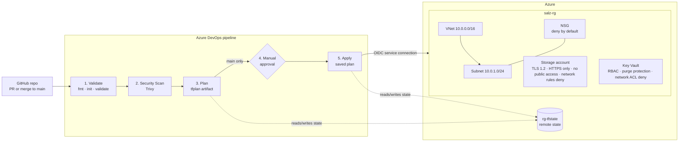
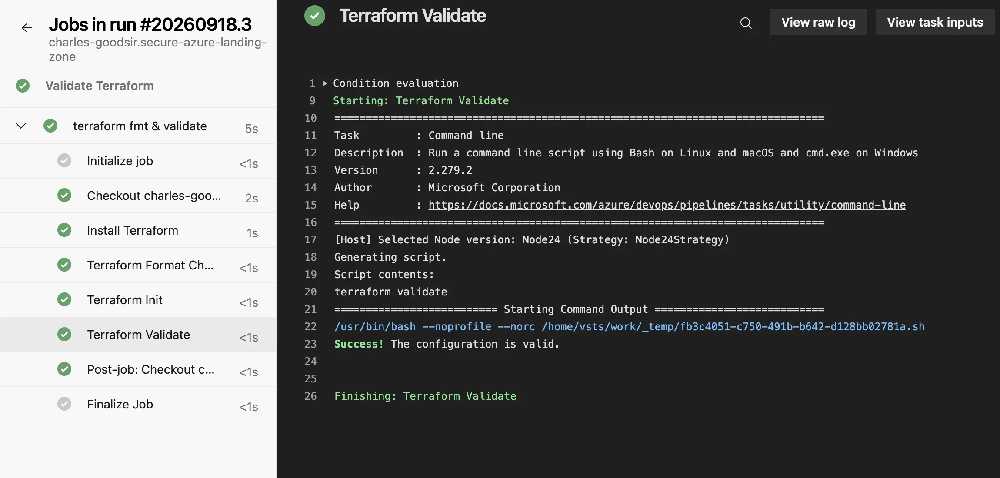
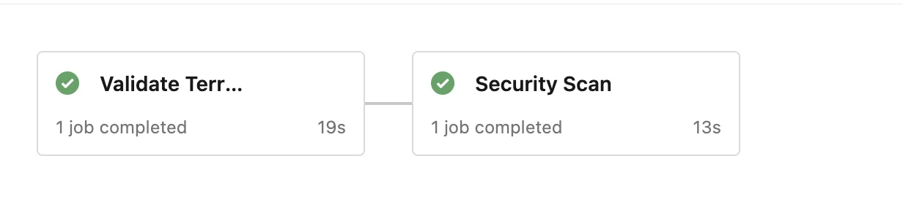
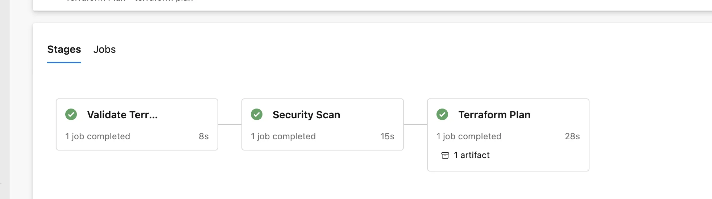
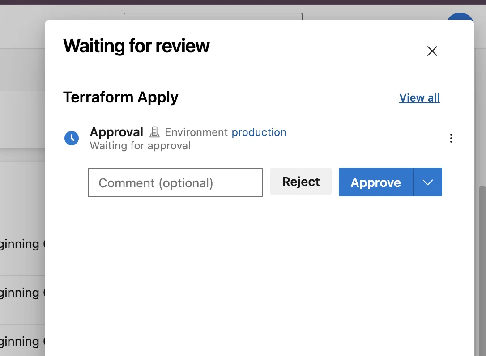
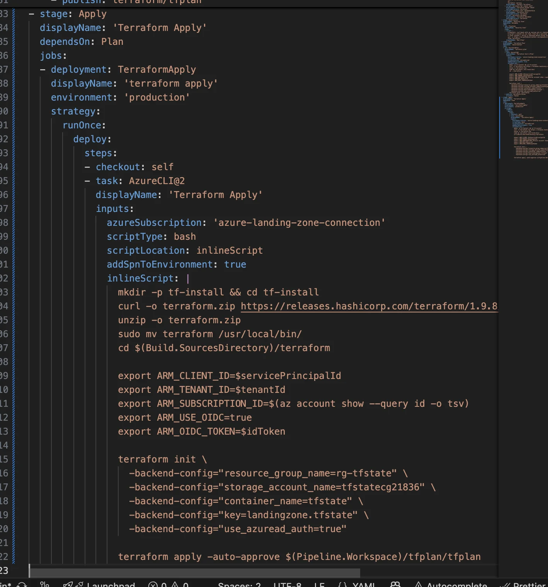
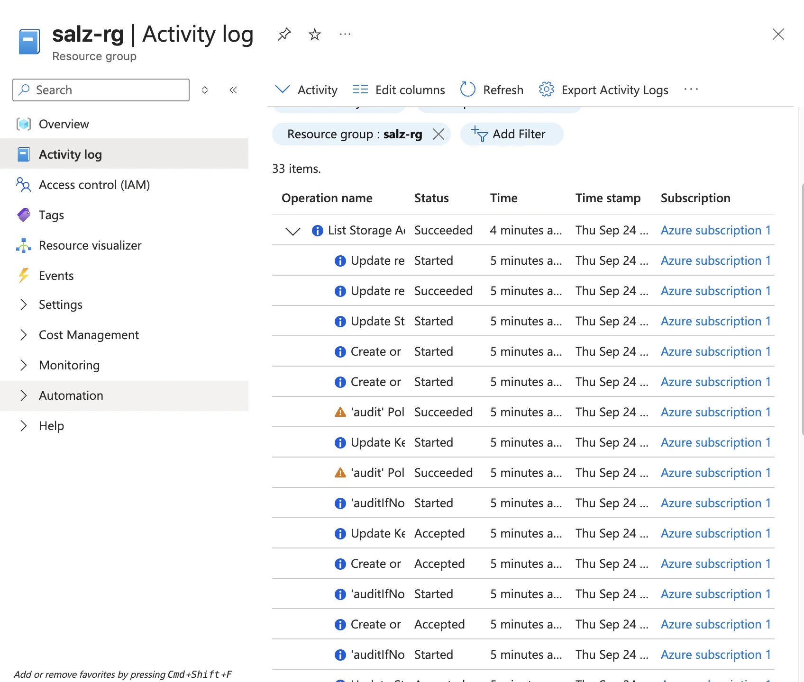
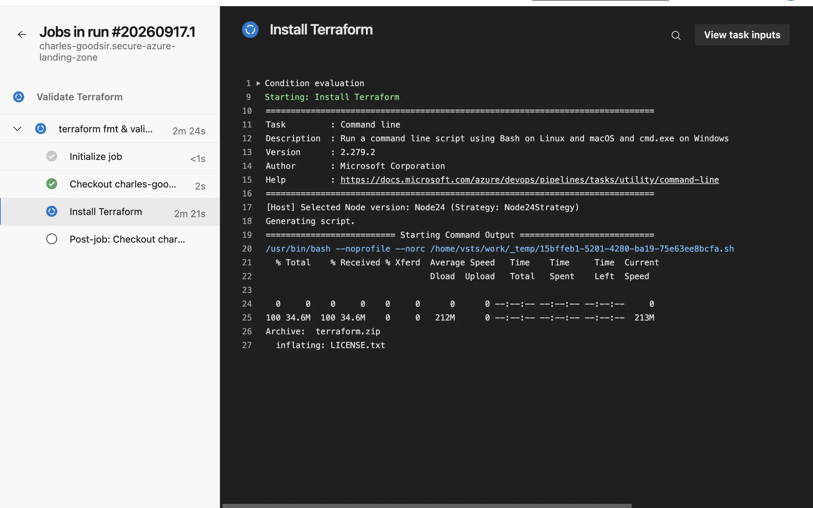
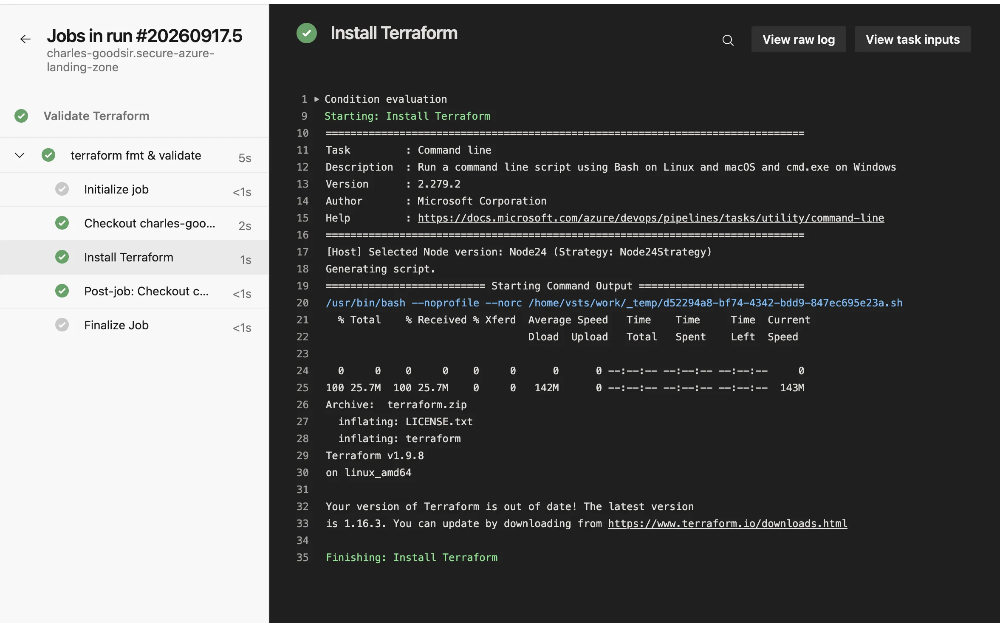

# Secure Azure Landing Zone

I defined a small Azure environment in Terraform and deploy it through an Azure DevOps pipeline. The pipeline checks and scans my code, then holds the deployment until I approve it.

> I built a Terraform-defined Azure environment that deploys through Azure Pipelines. Security
> scanning caught six misconfigurations in my own Key Vault and storage configs and blocked each
> deployment. I fixed four, accepted two with written reasons, and documented the before and
> after, applying the fix-and-verify habit from my AppSec homelab to infrastructure.

## What this demonstrates

- **Infrastructure as Code:** Terraform defines each Azure resource. I don't create anything by clicking in the Portal.
- **Shift-left security:** Trivy runs before `plan`. An insecure config fails the pipeline while it's still code.
- **Supply-chain checks:** the pipeline downloads pinned Terraform and Trivy releases and verifies each SHA-256 checksum before running them. A committed `.terraform.lock.hcl` pins the azurerm provider version and hashes, and each `terraform init` runs with `-lockfile=readonly`, so a provider that doesn't match fails the pipeline.
- **Change control:** a GitHub ruleset blocks direct pushes to `main`, so each change arrives through a pull request that has passed the pipeline. The Plan stage publishes the saved plan as an artifact, a manual approval gate sits in front of `apply`, and Apply runs the plan I approved without re-planning.
- **No stored secrets:** the pipeline signs in to Azure with workload identity federation (OIDC), so I have no client secret to leak.

## Architecture

## Resources deployed

| Resource | Security settings |
|---|---|
| Resource group `salz-rg` | Holds the resources below. It sits apart from the state storage |
| Virtual network + subnet | Private address space `10.0.0.0/16`, subnet `10.0.1.0/24` |
| Network security group | No allow rules, so Azure's implicit deny applies. Attached to the subnet |
| Storage account | Minimum TLS 1.2, HTTPS only, public network access disabled, network rules default `Deny`, infrastructure encryption |
| Key Vault | RBAC authorization, purge protection, 7-day soft delete, network ACL default `Deny` |

Terraform keeps its state in a separate resource group, `rg-tfstate`. I created that storage once by hand with `az cli`, since Terraform needs somewhere to write state before it can manage anything. The separation also protects the state: running `terraform destroy` on the landing zone can't delete it.

## The pipeline

[`azure-pipelines.yml`](../azure-pipelines.yml) defines the pipeline. It runs in two situations:

- **A pull request into `main`** runs Validate, Security Scan and Plan. Apply shows as skipped, so the PR tells me what would change without changing anything.
- **A merge into `main`** runs all five stages and deploys after I approve. Merges that only touch `docs/` skip this run, since they change no infrastructure. PRs still run on docs changes, because the ruleset needs the pipeline check to report before it allows a merge.

### Pull requests and branch protection
A GitHub ruleset on `main` requires a pull request, requires the Azure Pipelines check to pass, blocks force pushes and allows no bypass, including for me as the repo admin. The pipeline's own controls (the lock file, readonly init, the Trivy checksum and the `#trivy:ignore` comments) live in files a direct push could change, so the ruleset is what keeps them in place.

Two settings keep a PR from deploying or misusing credentials:

- The Apply stage has `condition: and(succeeded(), ne(variables['Build.Reason'], 'PullRequest'))`. ADO sets `Build.Reason` to `PullRequest` on PR runs, so Apply skips them.
- I turned off PR builds from forks in ADO. The repo is public, and a fork's PR would otherwise run the fork's version of the pipeline YAML with my service connection.

### 1. Validate
The stage installs Terraform 1.9.8 and runs `terraform fmt -check`, `terraform init -backend=false` and `terraform validate`. It catches mistakes in seconds and needs no Azure credentials.

Validate, Plan and Apply each install Terraform through one step template, [`templates/install-terraform.yml`](../templates/install-terraform.yml). It downloads the release with HashiCorp's `SHA256SUMS` file and verifies the zip under `set -euo pipefail` before installing. I built it after finding the install copied into three stages that had already drifted apart: one used a version variable, two hardcoded the version in the URL. A version bump is now one edit.

### 2. Security Scan
Trivy v0.74.0 scans `terraform/` with `trivy config --exit-code 1`. Trivy exits 0 by default even when it finds problems, so `--exit-code 1` is what makes a single finding fail the pipeline.

The stage downloads Trivy straight from its GitHub release and checks it against the release's SHA-256 checksum file. `set -euo pipefail` at the top of the script stops the step on a mismatch, before the binary runs.

I started with tfsec and switched to Trivy after tfsec's own logs announced it was moving into Trivy. [misconfiguration-findings.md](misconfiguration-findings.md) covers what each scanner caught.

### 3. Plan
The stage signs in through the service connection, connects to the remote backend and runs `terraform plan -out=tfplan`. It publishes the plan file as a pipeline artifact for Apply to use.

### 4. Manual approval
I made Apply a `deployment` job that targets an ADO environment called `production`. That environment has an approval check, so the pipeline pauses until I approve.

### 5. Apply
The stage checks out the repo, downloads the `tfplan` artifact and runs `terraform apply` against it.

The activity log for `salz-rg` shows the deployment. The `'audit'` entries come from Azure Policy checking each new resource:

## Problems I hit and how I fixed them

Most stages failed at least once before they worked.

| Problem | Cause | Fix |
|---|---|---|
| Install step hung until timeout | `unzip` waited at an "overwrite?" prompt, and a hosted agent has no stdin to answer it | `unzip -o` overwrites without asking |
| `Not found workingDirectory: .../terraform` | My install script ran `rm -rf terraform` at the repo root. The binary and my source folder shared the name `terraform`, so the script deleted my code | I moved the download and install into a separate `tf-install/` directory |
| `bashtfsec: command not found` | I lost a line break, which merged two shell commands into one | I restored the newline. In a YAML `script: \|` block, each line runs as its own shell command |
| `Authenticating using the Azure CLI is only supported as a User` | `AzureCLI@2` signs in the `az` CLI, but Terraform's azurerm backend handles its own sign-in and rejects CLI sign-in for a service principal | I set `addSpnToEnvironment: true` and exported `ARM_CLIENT_ID`, `ARM_TENANT_ID`, `ARM_SUBSCRIPTION_ID`, `ARM_USE_OIDC` and `ARM_OIDC_TOKEN` |
| Apply found no Terraform config | A `deployment` job skips the repo checkout that a regular `job` does | I added `- checkout: self`, ran from `$(Build.SourcesDirectory)/terraform` and pointed `apply` at `$(Pipeline.Workspace)/tfplan/tfplan` |
| The Trivy checksum check blocked nothing | Bash keeps running after a failed command, so a tampered download would print `FAILED` and then install and run anyway | I added `set -euo pipefail` as the script's first line |
| Apply condition that would have passed on PRs | I wrote `variables['Build Reason']` with a space instead of a dot. The lookup returns an empty string, which never equals `'PullRequest'`, so the condition stays true and Apply would run on every PR | I corrected it to `Build.Reason` and confirmed Apply shows as skipped on a PR run |
| `StorageAccountAlreadyTaken` during Apply | Enabling infrastructure encryption forces a replace. Terraform deleted the account and asked for the same globally unique name 6 seconds later, before Azure had released it | The account held no data, so I renamed it and ran a fresh plan. On a real account I'd plan this change as a migration |

The first problem, with the install step stuck on the prompt:

The same step after the fix:

## Known shortcuts

I left these in on purpose:

- **Two accepted Trivy findings:** GRS replication and storage analytics logging. [misconfiguration-findings.md](misconfiguration-findings.md) gives the reason for each. The logging acceptance expires on 31 Dec 2026, after which Trivy fails the pipeline again.
- **No second reviewer:** the ruleset requires 0 approvals, because GitHub won't let me approve my own PR. The passing pipeline check acts as the reviewer. A team repo would require at least one approval from someone other than the author.
- **Unpinned Trivy rules:** the Trivy binary is pinned, but it downloads its checks bundle fresh on each run. The same code can pass one day and fail the next. I accept that so new rules reach me without a pipeline change.
- **Trust on first download:** the lock file proves the provider hasn't changed since I locked it. Terraform checked HashiCorp's signature on that first download, but the hashes record what the registry served that day.
- **Checksums from the same source:** each checksum file comes from the same place as its binary: Trivy's GitHub release and HashiCorp's release server. They catch a corrupted or swapped download, but an attacker who controls a release could replace both files. Verifying the signatures would close that gap: cosign for Trivy, and HashiCorp's GPG signature on `SHA256SUMS`.
- **Hardcoded values:** I wrote names and the region straight into `main.tf` instead of using variables.
- **No private endpoints:** with public access disabled and no private endpoint, only Azure's trusted services can reach the storage account and Key Vault.
